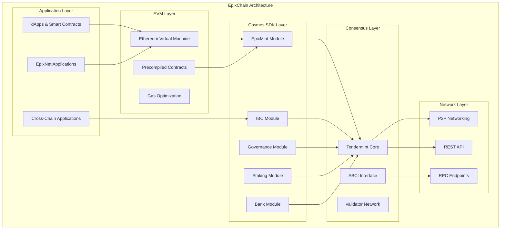

# EpixChain Architecture

EpixChain's architecture is designed as a multi-layered system that combines the best of Cosmos SDK's modularity with Ethereum's smart contract capabilities, all optimized for the decentralized web.

## System Overview

## Core Layers

### 1. Consensus Layer (Tendermint Core)

The foundation of EpixChain's security and performance:

- **Tendermint BFT Consensus**: Byzantine fault-tolerant consensus with instant finality
- **6-Second Block Times**: Optimized for fast transaction processing
- **Validator Network**: Decentralized set of validators securing the network
- **ABCI Interface**: Application Blockchain Interface connecting consensus to application logic

**Key Features:**
- Instant finality (no confirmation delays)
- Up to 1/3 Byzantine fault tolerance
- Deterministic block production
- Efficient state synchronization

### 2. Cosmos SDK Layer (Application Logic)

Modular blockchain framework providing core functionality:

#### Core Modules

**Bank Module**
- Token transfers and balance management
- Multi-denomination support
- Supply tracking and controls

**Staking Module**
- Validator delegation and rewards
- Slashing for misbehavior
- Governance voting power calculation

**Governance Module**
- On-chain proposal submission
- Community voting mechanisms
- Parameter change proposals

**IBC Module**
- Cross-chain communication
- Asset transfers between chains
- Interchain accounts

#### Custom Modules

**EpixMint Module**
- Dynamic token emission with exponential decay
- Block-time aware minting calculations
- Maximum supply protection (42B EPIX cap)
- Governance-controlled parameters

### 3. EVM Layer (Smart Contract Execution)

Full Ethereum Virtual Machine compatibility:

- **Solidity Support**: Deploy existing Ethereum contracts without modification
- **Web3 Compatibility**: Standard Ethereum JSON-RPC endpoints
- **Gas Optimization**: Efficient gas mechanics for lower transaction costs
- **State Management**: EVM state integrated with Cosmos SDK state

#### Precompiled Contracts

EpixChain includes 10+ precompiled contracts for enhanced functionality:

1. **Bank Precompile**: Native token operations
2. **Staking Precompile**: Validator delegation through EVM
3. **Distribution Precompile**: Reward claiming and management
4. **Governance Precompile**: Proposal voting from smart contracts
5. **IBC Precompile**: Cross-chain transfers via EVM
6. **ERC20 Precompile**: Native token wrapping
7. **Bech32 Precompile**: Address format conversion
8. **P256 Precompile**: Cryptographic operations
9. **Slashing Precompile**: Validator penalty information
10. **Callbacks Precompile**: Event-driven contract interactions

### 4. Network Layer

Communication and API interfaces:

- **P2P Networking**: Tendermint's gossip protocol for block and transaction propagation
- **JSON-RPC**: Ethereum-compatible API for dApp integration
- **REST API**: Cosmos SDK's REST interface for blockchain queries
- **gRPC**: High-performance API for advanced integrations
- **WebSocket**: Real-time event streaming

## Data Flow

### Transaction Processing

1. **Transaction Submission**: Users submit transactions via JSON-RPC or REST
2. **Mempool**: Transactions enter the mempool for validation
3. **Block Proposal**: Validators propose blocks with selected transactions
4. **Consensus**: Tendermint consensus validates and commits blocks
5. **State Update**: Application state is updated across all modules
6. **Event Emission**: Events are emitted for indexing and notifications

### Cross-Chain Communication

1. **IBC Packet Creation**: Source chain creates IBC packet
2. **Relayer Submission**: Relayers submit packet to destination chain
3. **Verification**: Destination chain verifies packet authenticity
4. **Execution**: Packet is executed on destination chain
5. **Acknowledgment**: Success/failure acknowledgment sent back

## Security Model

### Validator Security

- **Proof of Stake**: Economic security through staked EPIX tokens
- **Slashing Conditions**: Penalties for double-signing (5%) and downtime (1%)
- **Minimum Stake**: Dynamic minimum based on network participation
- **Delegation**: Token holders can delegate to validators

### Smart Contract Security

- **EVM Isolation**: Smart contracts run in isolated EVM environment
- **Gas Limits**: Prevent infinite loops and resource exhaustion
- **Access Controls**: Module-level permissions and restrictions
- **Upgrade Governance**: Protocol upgrades require community approval

### Network Security

- **Byzantine Fault Tolerance**: Up to 1/3 of validators can be malicious
- **Cryptographic Verification**: All transactions cryptographically signed
- **State Verification**: Merkle proofs for state integrity
- **Peer Authentication**: Secure P2P communication

## Performance Characteristics

### Throughput

- **Block Time**: 6 seconds (configurable via governance)
- **Transaction Throughput**: ~1000 TPS (varies by transaction type)
- **Finality**: Instant (single block confirmation)
- **State Size**: Optimized for efficient storage and retrieval

### Scalability Solutions

- **IBC Scaling**: Horizontal scaling through connected chains
- **Module Optimization**: Efficient state management and caching
- **Gas Optimization**: Reduced computational overhead
- **Pruning**: Historical state pruning for storage efficiency

## Integration Points

### For Developers

- **Ethereum Tools**: Use existing Ethereum development tools
- **Cosmos SDK**: Access to native blockchain modules
- **Cross-Chain**: Build applications spanning multiple chains
- **Custom Logic**: Implement custom business logic in modules

### For Users

- **MetaMask**: Connect with familiar Ethereum wallets
- **Cosmos Wallets**: Use Cosmos ecosystem wallets (Keplr, Cosmostation)
- **Cross-Chain**: Seamlessly move assets between chains
- **Governance**: Participate in protocol governance

### For Validators

- **Standard Setup**: Use standard Cosmos SDK validator setup
- **Monitoring**: Comprehensive metrics and alerting
- **Upgrades**: Coordinated network upgrades through governance
- **Rewards**: Earn rewards through block production and delegation

---

*This architecture enables EpixChain to serve as the foundation for a truly decentralized internet while maintaining compatibility with existing blockchain ecosystems.*
