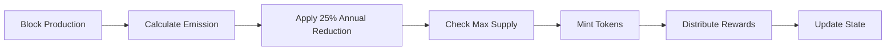

# EpixChain Tokenomics

EpixChain features a carefully designed tokenomics model that balances fair distribution, sustainable growth, and long-term value creation. Our custom EpixMint module implements dynamic token emission with exponential decay to reach a maximum supply of 42 billion EPIX over 20 years.

## Token Overview

### EPIX Token Specifications

| Property | Value |
|----------|-------|
| **Symbol** | EPIX |
| **Name** | EpixChain |
| **Decimals** | 18 |
| **Base Denomination** | aepix (1 EPIX = 10^18 aepix) |
| **Maximum Supply** | 42,000,000,000 EPIX (42 billion) |
| **Genesis Supply** | 23,689,538 EPIX |
| **Initial Annual Emission** | 10.527 billion EPIX (Year 1) |
| **Emission Reduction** | 25% annually |

## Fair Launch Model

### No Investors, No Team Funds

EpixChain launched with a commitment to true decentralization:

- **0% Investor Allocation**: No venture capital or private investor tokens
- **0% Team Allocation**: No pre-allocated tokens for the development team
- **100% Community**: All tokens distributed to the community through fair mechanisms

### Genesis Distribution

**Total Genesis Supply: 23,689,538 EPIX**

1. **Airdrop to Snapshot Holders**: 11,844,769 EPIX (50%)
   - Distributed to holders captured in the snapshot
   - Fair distribution based on historical participation

2. **Community Pool**: 11,844,769 EPIX (50%)
   - Controlled by governance for ecosystem development
   - Funding for grants, partnerships, and community initiatives

## Dynamic Emission Schedule

### EpixMint Module

Our custom minting module implements sophisticated tokenomics:

### Annual Emission Breakdown

| Year | Annual Emission (EPIX) | Cumulative Supply (EPIX) | Reduction Rate |
|------|----------------------|-------------------------|----------------|
| 0 (Genesis) | - | 23,689,538 | - |
| 1 | 10,527,000,000 | 10,550,689,538 | - |
| 2 | 7,895,250,000 | 18,445,939,538 | 25% |
| 3 | 5,921,437,500 | 24,367,377,038 | 25% |
| 4 | 4,441,078,125 | 28,808,455,163 | 25% |
| 5 | 3,330,808,594 | 32,139,263,757 | 25% |
| 10 | 1,113,586,426 | 39,234,567,890 | 25% |
| 15 | 372,195,476 | 41,456,789,123 | 25% |
| 20 | 124,398,492 | 42,000,000,000 | 25% |

### Key Features

**Block-Time Awareness**
- Emission calculations adjust for actual block times
- Maintains consistent annual emission regardless of consensus changes
- Governance can modify block time parameters

**Maximum Supply Protection**
- Hard cap at 42 billion EPIX
- Automatic emission reduction as cap approaches
- No possibility of exceeding maximum supply

**Smooth Exponential Decay**
- 25% annual reduction in emission rate
- Predictable long-term supply schedule
- Balances early adoption incentives with long-term sustainability

## Token Distribution Mechanisms

### Staking Rewards

**Validator Rewards**
- Block production rewards from newly minted tokens
- Commission from delegator rewards
- Slashing penalties for misbehavior

**Delegator Rewards**
- Proportional share of validator rewards
- Compound through automatic re-delegation
- Liquid staking compatibility

### Community Pool

**Funding Sources**
- 2% community tax on staking rewards (configurable)
- Genesis allocation of 11.8M EPIX
- Governance-directed allocations

**Usage**
- Developer grants and bounties
- Marketing and ecosystem development
- Infrastructure and tooling support
- Community events and initiatives

## Governance Economics

### Voting Power

- **1 EPIX = 1 Vote** (when staked)
- Delegated tokens inherit voting power
- Validators can vote on behalf of delegators
- Delegators can override validator votes

### Proposal Economics

| Parameter | Value |
|-----------|-------|
| **Minimum Deposit** | 1,000 EPIX |
| **Voting Period** | 7 days |
| **Quorum** | 33.4% of staked tokens |
| **Pass Threshold** | 50% of participating votes |
| **Veto Threshold** | 33.4% of participating votes |

### Governance Parameters

**Modifiable via Governance**
- Block time (currently 6 seconds)
- Community tax rate (currently 2%)
- Staking parameters
- Slashing conditions
- IBC parameters

## Economic Incentives

### Staking Economics

**Annual Percentage Rate (APR)**
- Variable based on total staked percentage
- Target: 60-70% of total supply staked
- Higher rewards when less tokens are staked
- Lower rewards when more tokens are staked

**Slashing Conditions**
- **Double Sign**: 5% of staked tokens slashed
- **Downtime**: 1% of staked tokens slashed
- **Tombstoning**: Permanent exclusion for severe violations

### Transaction Economics

**Gas Fees**
- Paid in EPIX tokens
- Dynamic pricing based on network congestion
- Burned or redistributed to validators
- Optimized for low-cost transactions

**Cross-Chain Fees**
- IBC transfer fees in EPIX
- Relayer incentivization
- Cross-chain security deposits

## Utility and Use Cases

### Network Utility

1. **Transaction Fees**: Pay for all network operations
2. **Staking**: Secure the network and earn rewards
3. **Governance**: Vote on protocol upgrades and parameters
4. **IBC Transfers**: Cross-chain asset movement
5. **Smart Contract Gas**: Execute EVM transactions

### EpixNet Integration

1. **Hosting Fees**: Pay for decentralized web hosting
2. **Content Delivery**: Incentivize content distribution
3. **Storage Payments**: Decentralized storage services
4. **Bandwidth Rewards**: Compensate network participants

### DeFi Integration

1. **Liquidity Provision**: DEX and AMM participation
2. **Lending/Borrowing**: Collateral for DeFi protocols
3. **Yield Farming**: Earn additional rewards
4. **Cross-Chain DeFi**: Participate in multi-chain protocols

## Long-Term Sustainability

### Deflationary Mechanisms

- **Transaction Fee Burning**: Reduce circulating supply
- **Slashing**: Remove tokens from circulation
- **Lost Keys**: Natural supply reduction over time

### Value Accrual

- **Network Growth**: Increased demand for EPIX
- **EpixNet Adoption**: Utility-driven demand
- **Cross-Chain Activity**: IBC ecosystem growth
- **DeFi Integration**: Expanded use cases

### Economic Security

- **High Staking Ratio**: Strong network security
- **Validator Diversity**: Decentralized consensus
- **Governance Participation**: Community-driven decisions
- **Transparent Tokenomics**: Predictable supply schedule

---

*EpixChain's tokenomics are designed to create a sustainable, fair, and valuable ecosystem that grows with adoption while maintaining strong economic incentives for all participants.*
