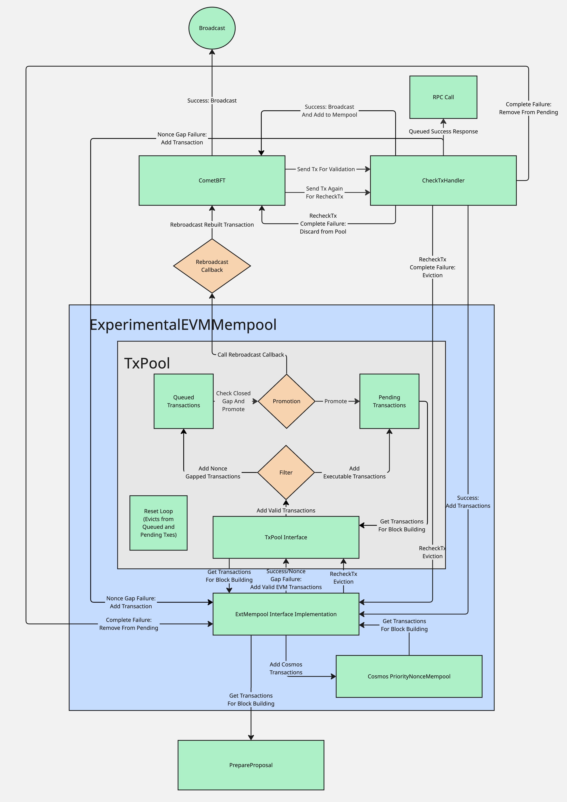

# `mempool`

## Abstract

This document specifies the appside mempool implementation of Cosmos EVM.

The EVM mempool is responsible for managing both EVM and Cosmos transactions in a unified pool, enabling Ethereum-compatible transaction flows including out-of-order transactions and nonce gap handling. It serves as a replacement for the default CometBFT FIFO mempool to support Ethereum tooling expectations while maintaining Cosmos SDK compatibility.

The mempool implements a two-tier architecture: a local transaction pool for queuing nonce-gapped transactions and CometBFT broadcasting for executable transactions, preventing network spam while enabling proper EVM transaction semantics.

## Contents

- [Concepts](#concepts)
  - [Problem Statement](#problem-statement)
  - [Design Principles](#design-principles)
  - [Transaction States](#transaction-states)
  - [Fee Prioritization](#fee-prioritization)
- [Architecture](#architecture)
  - [ExperimentalEVMMempool](#experimentalevmmempool)
  - [TxPool](#txpool)
  - [Miner](#miner)
  - [Iterator](#iterator)
  - [CheckTx Handler](#checktx-handler)
  - [Blockchain Interface](#blockchain-interface)
- [Transaction Flow](#transaction-flow)
  - [Normal Flow](#normal-flow)
  - [Nonce Gap Flow](#nonce-gap-flow)
  - [Block Building](#block-building)
- [State](#state)
- [Keepers](#keepers)
- [Events](#events)
- [Client](#client)
  - [gRPC](#grpc)

## Concepts

### Problem Statement

The default CometBFT mempool is incompatible with Ethereum tooling (Forge, Hardhat, deployment scripts) due to fundamental differences in transaction ordering expectations:

1. **FIFO vs Priority Ordering**: CometBFT uses strict FIFO ordering, while Ethereum tools expect fee-based prioritization
2. **Nonce Gap Rejection**: CometBFT immediately rejects out-of-order nonces, while Ethereum tools expect such transactions to queue until executable
3. **Base Fee Dynamics**: Transactions may become temporarily invalid due to base fee increases but should remain in the mempool

Example incompatibility from OP Stack deployment:
```
ERROR unable to publish transaction nonce=39 expected=12: invalid sequence
ERROR unable to publish transaction nonce=40 expected=12: invalid sequence
ERROR unable to publish transaction nonce=41 expected=12: invalid sequence
```

### Design Principles

1. **Instant Finality**: Designed for Cosmos chains with instant finality (no reorgs)
2. **Two-Tier Architecture**: Local queuing + CometBFT broadcasting prevents network spam
3. **Fee-Based Prioritization**: Unified fee comparison between EVM and Cosmos transactions
4. **Ethereum Compatibility**: Supports nonce gaps and transaction queuing semantics

### Transaction States

The mempool manages transactions in three states:

- **Pending**: Immediately executable transactions (nonce matches account state)
- **Queued**: Future transactions with nonce gaps awaiting prerequisite transactions
- **Promoted**: Asynchronous transition from queued to pending via background processes

### Fee Prioritization

Transaction selection uses effective tip calculation:

- **EVM**: `gas_tip_cap` or `min(gas_tip_cap, gas_fee_cap - base_fee)`
- **Cosmos**: `(fee_amount / gas_limit) - base_fee`

Higher effective tips are prioritized regardless of transaction type. In the event of a tie, EVM transactions are prioritized

## Architecture

### ExperimentalEVMMempool

The main coordinator implementing Cosmos SDK's `ExtMempool` interface.

**Location**: `mempool/mempool.go`

**Key Methods**:
- `Insert(ctx, tx)`: Routes transactions to appropriate pools
- `Select(ctx, filter)`: Returns unified iterator over all transactions  
- `Remove(tx)`: Handles transaction removal with EVM-specific logic
- `InsertInvalidNonce(txBytes)`: Queues nonce-gapped EVM transactions without broadcasting them to the chain.
A special failure case is sent via CheckTx, and the transaction is stored locally until it either gets included or evicted.

**Configuration**:
```go
type EVMMempoolConfig struct {
    TxPool        *txpool.TxPool
    CosmosPool    sdkmempool.ExtMempool
    AnteHandler   sdk.AnteHandler
    BroadCastTxFn func(txs []*ethtypes.Transaction) error
    BlockGasLimit uint64
}
```

### TxPool

Ethereum transaction pool forked from go-ethereum v1.15.11 with Cosmos adaptations.

**Location**: `mempool/txpool/`

**Key Modifications**:
- Uses `vm.StateDB` interface instead of go-ethereum's StateDB
- Implements `BroadcastTxFn` callback for transaction promotion. When nonce gaps are filled, the callback broadcasts
via the Comet mempool
- Cosmos-specific reset logic for instant finality. The TxPool was originally built for chains where block reorgs are possible,
but this does not apply to instant finality chains, so the mempool ensures that the reorg flow is skipped.

**Subpools**: Currently uses only `LegacyPool` for standard EVM transactions

### Miner

Transaction ordering mechanism from go-ethereum v1.15.11, unchanged from upstream.

**Location**: `mempool/miner/ordering.go`

**Functionality**:
- Priority heap-based transaction selection (`TransactionsByPriceAndNonce`)
- Per-account nonce ordering
- Base fee consideration for effective tip calculation

### Iterator

Unified iterator combining EVM and Cosmos transaction streams.

**Location**: `mempool/iterator.go`

**Selection Logic**:
```go
func (i *EVMMempoolIterator) shouldUseEVM() bool {
    // 1. Availability check
    // 2. Fee comparison: effective_tip_evm vs effective_tip_cosmos
    // 3. EVM preferred on ties or invalid Cosmos fees
}
```

### CheckTx Handler

Customizes transaction validation to handle nonce gaps specially.

**Location**: `mempool/check_tx.go`

**Special Handling**: On `ErrNonceGap` for EVM transactions, attempts `InsertInvalidNonce()` and returns success via the RPC to prevent client errors

### Blockchain Interface

Adapter providing go-ethereum compatibility over Cosmos SDK state.

**Location**: `mempool/blockchain.go`

**Features**:
- Block height synchronization (requires block 1+ for operation)
- State database interface translation
- Reorg protection (panics on reorg attempts)

## Transaction Flow

The following diagram illustrates the complete transaction flow architecture, showing how transactions move through the system from initial RPC calls to block inclusion:



### Flow Descriptions

#### Normal Flow
```
Client → CometBFT → CheckTx → Success → TxPool.Add() → Broadcast → Block Inclusion
                           └─ Failure → Reject
```

#### Nonce Gap Flow
```
Client → CometBFT → CheckTx → Nonce Gap → InsertInvalidNonce() → Queue
                                      └─ Return Success (prevent client error)
                                      
Background: Queued → Promotion Check → Pending → Broadcast
```

#### Components

The diagram shows the complete interaction between all mempool components:

1. **RPC Call**: Transaction submitted via JSON-RPC or Comet RPC
2. **CometBFT**: Receives and routes transaction to CheckTx validation
3. **CheckTxHandler**: Custom handler that intercepts nonce gap failures and provides special handling
4. **ExperimentalEVMMempool**: Main coordinator implementing the ExtMempool interface
5. **TxPool**: EVM-specific transaction pool with queued/pending state management
6. **Promotion Process**: Background logic that moves queued → pending when nonce gaps are filled
7. **Rebroadcast Callback**: Mechanism that triggers network broadcasting when transactions are promoted
8. **Cosmos PriorityNonceMempool**: Handles standard Cosmos SDK transactions with fee-based priority
9. **PrepareProposal**: Block building process that selects transactions from unified iterator

#### Transaction States

- **Queued**: Transactions with nonce gaps, stored locally (not broadcast to network)
- **Pending**: Immediately executable transactions available for block inclusion
- **Promoted**: Queued transactions that become executable when gaps are filled
- **Broadcast**: Transactions announced to network peers for propagation

## State

The mempool module maintains the following state:

1. **EVM Transaction Pool**: Managed by forked go-ethereum txpool
   - Pending transactions (immediately executable)
   - Queued transactions (nonce gaps)
   - Account nonces and balances via StateDB interface

2. **Cosmos Transaction Pool**: Standard Cosmos SDK priority mempool
   - Priority-based transaction ordering
   - Fee-based prioritization

3**Block Height**: Requires block 1+ before accepting transactions

## Keepers

The mempool does not directly expose keepers but integrates with existing Cosmos SDK keepers:

```go
type VMKeeperI interface {
    GetBaseFee(ctx sdk.Context) *big.Int
    SetEvmMempool(mempool *ExperimentalEVMMempool)
}

type FeeMarketKeeperI interface {
    // Used for base fee calculations in blockchain interface
}
```

## Events

The mempool does not emit custom events. Transaction events are emitted by the underlying:
- EVM transactions: Standard EVM execution events
- Cosmos transactions: Standard Cosmos SDK bank/transfer events
- Logging is available by setting the level to `debug`

## Integration

### App.go Setup

To integrate the EVM mempool in your Cosmos application, follow the pattern used in `evmd/app.go`:

#### 1. Add EVM Mempool to App Struct

```go
type EVMD struct {
    *baseapp.BaseApp
    // ... other keepers
    
    // Cosmos EVM keepers
    FeeMarketKeeper   feemarketkeeper.Keeper
    EVMKeeper         *evmkeeper.Keeper
    EVMMempool        *evmmempool.ExperimentalEVMMempool
}
```

#### 2. Configure Mempool in NewApp Constructor

```go
// Set the EVM priority nonce mempool
if evmtypes.GetChainConfig() != nil {
    mempoolConfig := &evmmempool.EVMMempoolConfig{
        AnteHandler:   app.GetAnteHandler(),
        BlockGasLimit: 100_000_000,
    }

    evmMempool := evmmempool.NewExperimentalEVMMempool(
        app.CreateQueryContext, 
        logger, 
        app.EVMKeeper, 
        app.FeeMarketKeeper, 
        app.txConfig, 
        app.clientCtx, 
        mempoolConfig,
    )
    app.EVMMempool = evmMempool

    // Set the global mempool for RPC access
    if err := evmmempool.SetGlobalEVMMempool(evmMempool); err != nil {
        panic(err)
    }
    
    // Replace BaseApp mempool
    app.SetMempool(evmMempool)
    
    // Set custom CheckTx handler for nonce gap support
    checkTxHandler := evmmempool.NewCheckTxHandler(evmMempool)
    app.SetCheckTxHandler(checkTxHandler)

    // Set custom PrepareProposal handler
    abciProposalHandler := baseapp.NewDefaultProposalHandler(evmMempool, app)
    abciProposalHandler.SetSignerExtractionAdapter(
        evmmempool.NewEthSignerExtractionAdapter(
            sdkmempool.NewDefaultSignerExtractionAdapter(),
        ),
    )
    app.SetPrepareProposal(abciProposalHandler.PrepareProposalHandler())
}
```

### Configuration Options

The `EVMMempoolConfig` struct provides several configuration options:

#### Required Configuration

```go
type EVMMempoolConfig struct {
    // AnteHandler for transaction validation
    AnteHandler   sdk.AnteHandler
    
    // Block gas limit for transaction selection
    BlockGasLimit uint64
    
    // Optional: Custom TxPool (defaults to LegacyPool)
    TxPool        *txpool.TxPool
    
    // Optional: Custom Cosmos pool (defaults to PriorityNonceMempool)  
    CosmosPool    sdkmempool.ExtMempool
    
    // Optional: Custom broadcast function for promoted transactions
    BroadCastTxFn func(txs []*ethtypes.Transaction) error
}
```

#### Configuration Examples

**Minimal Configuration**:
```go
mempoolConfig := &evmmempool.EVMMempoolConfig{
    AnteHandler:   app.GetAnteHandler(),
    BlockGasLimit: 100_000_000, // 100M gas limit
}
```

**Custom Cosmos Mempool Configuration**:

The mempool uses a `PriorityNonceMempool` for Cosmos transactions by default. You can customize the priority calculation:

```go
// Define custom priority calculation for Cosmos transactions
priorityConfig := sdkmempool.PriorityNonceMempoolConfig[math.Int]{
    TxPriority: sdkmempool.TxPriority[math.Int]{
        GetTxPriority: func(goCtx context.Context, tx sdk.Tx) math.Int {
            feeTx, ok := tx.(sdk.FeeTx)
            if !ok {
                return math.ZeroInt()
            }
            
            // Get fee in bond denomination
            bondDenom := "uatom" // or your chain's bond denom
            fee := feeTx.GetFee()
            found, coin := fee.Find(bondDenom)
            if !found {
                return math.ZeroInt()
            }
            
            // Calculate gas price: fee_amount / gas_limit
            gasPrice := coin.Amount.Quo(math.NewIntFromUint64(feeTx.GetGas()))
            return gasPrice
        },
        Compare: func(a, b math.Int) int {
            return a.BigInt().Cmp(b.BigInt()) // Higher values have priority
        },
        MinValue: math.ZeroInt(),
    },
}

mempoolConfig := &evmmempool.EVMMempoolConfig{
    AnteHandler:   app.GetAnteHandler(),
    BlockGasLimit: 100_000_000,
    CosmosPool:    sdkmempool.NewPriorityMempool(priorityConfig),
}
```

**Custom Block Gas Limit**:
```go
// Example: 50M gas limit for lower capacity chains
mempoolConfig := &evmmempool.EVMMempoolConfig{
    AnteHandler:   app.GetAnteHandler(),
    BlockGasLimit: 50_000_000,
}
```

### Prerequisites

Before integrating the EVM mempool, ensure your application has:

1. **EVM Module Integration**: The EVM keeper and module must initialized *before* the mempool
2. **FeeMarket Module**: Required for base fee calculations
3. **Compatible AnteHandler**: Must support EVM transaction validation. The default EVMD antehandler is recommended here


## Client

### JSON-RPC

The mempool extends RPC functionality through the `/txpool` namespace compatible with go-ethereum:

#### txpool_status

Returns pool statistics (pending/queued transaction counts).

```shell
curl -X POST -H "Content-Type: application/json" \
  --data '{"method":"txpool_status","params":[],"id":1,"jsonrpc":"2.0"}' \
  http://localhost:8545
```

Example Output:
```json
{
  "jsonrpc": "2.0",
  "id": 1,
  "result": {
    "pending": 42,
    "queued": 7
  }
}
```

#### txpool_content

Returns full transaction content grouped by account and state.

```shell
curl -X POST -H "Content-Type: application/json" \
  --data '{"method":"txpool_content","params":[],"id":1,"jsonrpc":"2.0"}' \
  http://localhost:8545
```

#### txpool_contentFrom

Returns transactions from a specific address.

```shell
curl -X POST -H "Content-Type: application/json" \
  --data '{"method":"txpool_contentFrom","params":["0x1234..."],"id":1,"jsonrpc":"2.0"}' \
  http://localhost:8545
```

#### txpool_inspect

Returns transaction summaries without full transaction data.

```shell
curl -X POST -H "Content-Type: application/json" \
  --data '{"method":"txpool_inspect","params":[],"id":1,"jsonrpc":"2.0"}' \
  http://localhost:8545
```