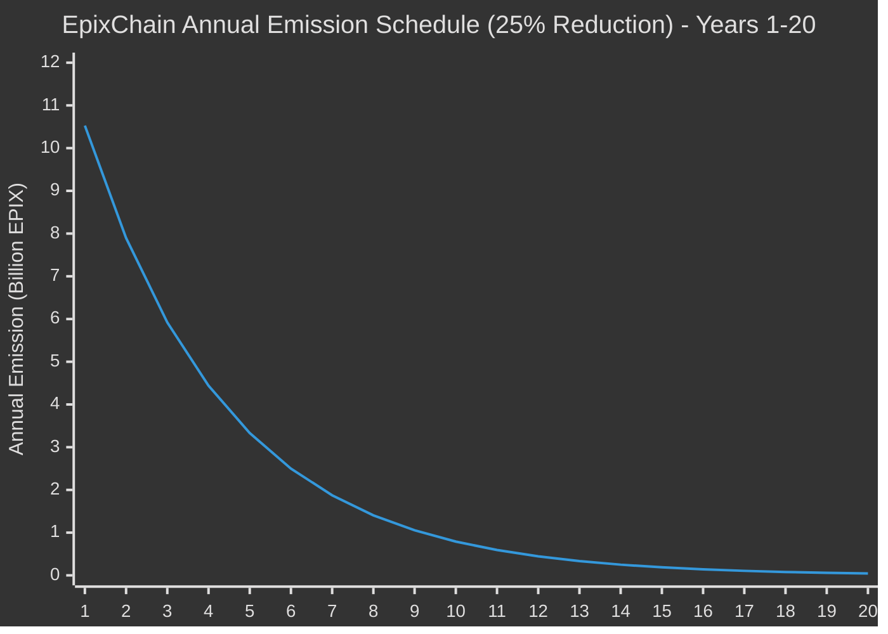
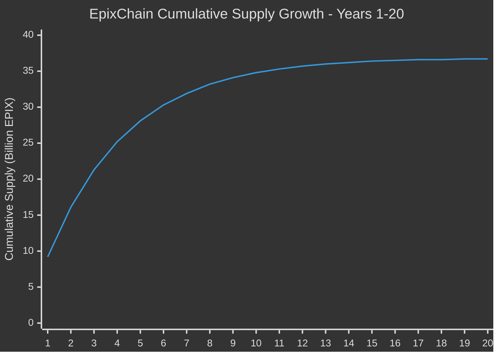

# EpixMint Module

The EpixMint module implements a dynamic token emission system with exponential decay for the EpixChain blockchain.

## Overview

The EpixMint module replaces the standard Cosmos SDK mint module with a custom implementation that provides:

- **Dynamic emission rates** with smooth exponential decay
- **Block-time awareness** for consistent emission regardless of consensus changes
- **Maximum supply protection** to prevent exceeding the 42B EPIX cap
- **Governance-controlled parameters** for flexibility

## Tokenomics

### Emission Schedule

- **Initial Annual Emission**: 10.527 billion EPIX (rate at genesis)
- **Annual Reduction Rate**: 25% per year (smooth per-block decay)
- **Decay Period**: 20 years of exponential decay
- **Tail Emission**: After year 20, emission continues at ~33.4M EPIX/year
- **Maximum Supply**: 42 billion EPIX (hard cap with protection)

#### Emission Curve Visualization



#### Cumulative Supply Growth



> **Note**: With smooth per-block decay, approximately 36.7B EPIX is minted in the first 20 years. After year 20, a constant "tail emission" of ~33.4M EPIX/year continues until the 42B max supply is reached (approximately year 178).

### Emission Formula

The module uses smooth per-block exponential decay:

```
current_rate = initial_amount × (1 - reduction_rate)^(blocks_elapsed / blocks_per_year)
tokens_per_block = current_rate / blocks_per_year
```

Where:
- `initial_amount` = 10.527B EPIX
- `reduction_rate` = 0.25 (25%)
- `blocks_per_year` = calculated dynamically from block time

### Emission Distribution

- **98%** to staking rewards (validators and delegators)
- **2%** to community pool

## Parameters

| Parameter | Type | Description | Default |
|-----------|------|-------------|---------|
| `mint_denom` | string | Denomination to mint | "aepix" |
| `initial_annual_mint_amount` | Int | Starting emission amount | 10.527B EPIX |
| `annual_reduction_rate` | Dec | Annual reduction percentage | 0.25 (25%) |
| `block_time_seconds` | uint64 | Expected block time | 6 seconds |
| `max_supply` | Int | Maximum total supply | 42B EPIX |
| `community_pool_rate` | Dec | Community pool allocation | 0.02 (2%) |
| `staking_rewards_rate` | Dec | Staking rewards allocation | 0.98 (98%) |

## Key Features

### 1. Block-Time Agnostic

The system automatically adjusts emission rates based on the configured block time. If governance changes the block time, the per-block emission adjusts to maintain the same annual rate.

### 2. Smooth Exponential Decay

Instead of step-wise annual reductions, the system applies continuous exponential decay on a per-block basis, resulting in perfectly smooth emission curves.

### 3. Maximum Supply Protection

Multiple layers of protection ensure the total supply never exceeds 42B EPIX:
- Pre-mint supply check
- Precise amount calculation to reach exactly 42B
- Zero-amount minting prevention

### 4. Governance Integration

All parameters can be updated via governance proposals using the `MsgUpdateParams` message.

## Queries

### Current Emission Rate
```bash
epixd query epixmint annual-provisions
```

### Current Inflation Rate
```bash
epixd query epixmint inflation
```

### Current Supply
```bash
epixd query epixmint current-supply
```

### Maximum Supply
```bash
epixd query epixmint max-supply
```

### Parameters
```bash
epixd query epixmint params
```

### Supply by Denomination
```bash
# Query supply in aepix (base denomination with 18 decimals)
epixd query epixmint supply-of aepix

# Query supply in epix (display denomination, returns integer EPIX units)
# Note: Fractional EPIX amounts are truncated (e.g., 1.7 EPIX returns 1)
epixd query epixmint supply-of epix
```

## REST API Endpoints

The EpixMint module exposes the following REST API endpoints:

- `GET /epix/mint/v1beta1/params` - Query module parameters
- `GET /epix/mint/v1beta1/inflation` - Query current inflation rate
- `GET /epix/mint/v1beta1/annual_provisions` - Query annual provisions
- `GET /epix/mint/v1beta1/current_supply` - Query current supply (mint denomination)
- `GET /epix/mint/v1beta1/max_supply` - Query maximum supply
- `GET /epix/mint/v1beta1/supply/{denom}` - Query supply of specific denomination

### Examples

```bash
# Query supply in aepix (base denomination)
curl http://localhost:1317/epix/mint/v1beta1/supply/aepix

# Query supply in epix (display denomination, returns integer EPIX units)
curl http://localhost:1317/epix/mint/v1beta1/supply/epix
```

## Simple Supply API

For trackers that require simple parameter-based queries, EpixChain provides a simplified API endpoint:

```bash
# Get total coins (circulating supply) - returns plain text number
curl http://localhost:1317/api.dws?q=totalcoins

# Get circulating supply (same as totalcoins)
curl http://localhost:1317/api.dws?q=circulatingsupply

# Get maximum supply
curl http://localhost:1317/api.dws?q=maxsupply
```

All responses are returned as plain text numbers in EPIX units (not aEPIX).

**Note**: When querying for `epix`, the response returns the supply as an integer number of EPIX tokens. Fractional amounts are truncated following Cosmos SDK conventions.

## CLI Commands

### Update Parameters (Governance)
```bash
epixd tx epixmint update-params \
  aepix \
  10527000000000000000000000000 \
  0.25 \
  6 \
  42000000000000000000000000000 \
  0.02 \
  0.98 \
  --from mykey
```

## Migration from Standard Mint Module

The EpixMint module is designed to replace the standard Cosmos SDK mint module:

1. **Disable standard mint**: Set inflation parameters to zero
2. **Enable EpixMint**: Configure with desired parameters
3. **Governance control**: Both modules support parameter updates via governance

## Mathematical Verification

The emission schedule uses smooth per-block exponential decay:

- **Year 1**: ~9.2B EPIX minted (rate starts at 10.527B, ends at 7.895B)
- **Year 5**: ~2.9B EPIX minted
- **Year 10**: ~519M EPIX minted
- **Year 20**: ~29M EPIX minted
- **After Year 20**: ~33.4M EPIX/year (constant tail emission)
- **Total at Year 20**: ~36.7B EPIX
- **Max Supply Reached**: ~Year 178

The tail emission (constant rate after year 20) ensures the chain eventually reaches the 42B max supply. The maximum supply protection ensures the total never exceeds exactly 42B EPIX.
