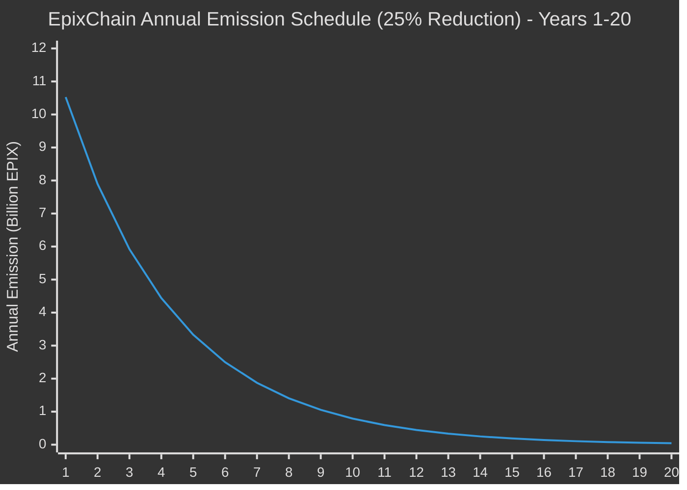
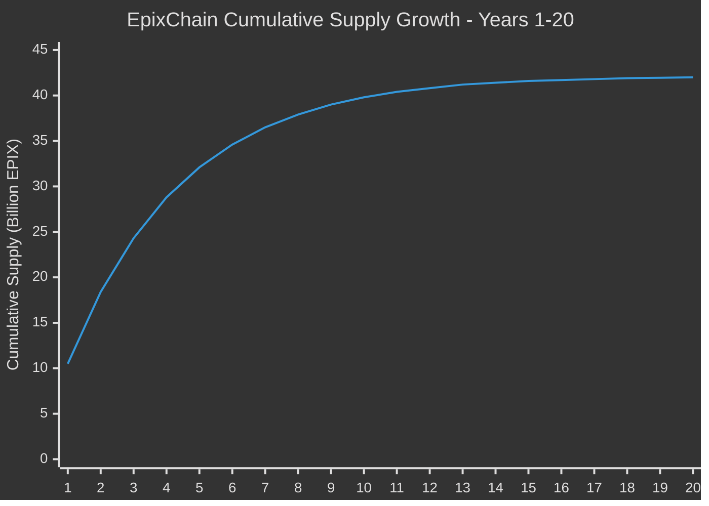

# EpixMint Module

The EpixMint module implements a dynamic token emission system with exponential decay for the EpixChain blockchain.

## Overview

The EpixMint module replaces the standard Cosmos SDK mint module with a custom implementation that provides:

- **Dynamic emission rates** with smooth exponential decay
- **Block-time awareness** for consistent emission regardless of consensus changes
- **Maximum supply protection** to prevent exceeding the 42B EPIX cap
- **Governance-controlled parameters** for flexibility

## Tokenomics

### Emission Schedule

- **Initial Annual Emission**: 10.527 billion EPIX in year 1
- **Annual Reduction Rate**: 25% per year
- **Total Duration**: Approximately 20 years to reach max supply
- **Maximum Supply**: 42 billion EPIX (hard cap with protection)

#### Emission Curve Visualization



#### Cumulative Supply Growth



### Emission Formula

The module uses smooth per-block exponential decay:

```
current_rate = initial_amount × (1 - reduction_rate)^(blocks_elapsed / blocks_per_year)
tokens_per_block = current_rate / blocks_per_year
```

Where:
- `initial_amount` = 10.527B EPIX
- `reduction_rate` = 0.25 (25%)
- `blocks_per_year` = calculated dynamically from block time

### Emission Distribution

- **98%** to staking rewards (validators and delegators)
- **2%** to community pool

## Parameters

| Parameter | Type | Description | Default |
|-----------|------|-------------|---------|
| `mint_denom` | string | Denomination to mint | "aepix" |
| `initial_annual_mint_amount` | Int | Starting emission amount | 10.527B EPIX |
| `annual_reduction_rate` | Dec | Annual reduction percentage | 0.25 (25%) |
| `block_time_seconds` | uint64 | Expected block time | 6 seconds |
| `max_supply` | Int | Maximum total supply | 42B EPIX |
| `community_pool_rate` | Dec | Community pool allocation | 0.02 (2%) |
| `staking_rewards_rate` | Dec | Staking rewards allocation | 0.98 (98%) |

## Key Features

### 1. Block-Time Agnostic

The system automatically adjusts emission rates based on the configured block time. If governance changes the block time, the per-block emission adjusts to maintain the same annual rate.

### 2. Smooth Exponential Decay

Instead of step-wise annual reductions, the system applies continuous exponential decay on a per-block basis, resulting in perfectly smooth emission curves.

### 3. Maximum Supply Protection

Multiple layers of protection ensure the total supply never exceeds 42B EPIX:
- Pre-mint supply check
- Precise amount calculation to reach exactly 42B
- Zero-amount minting prevention

### 4. Governance Integration

All parameters can be updated via governance proposals using the `MsgUpdateParams` message.

## Queries

### Current Emission Rate
```bash
epixd query epixmint annual-provisions
```

### Current Inflation Rate
```bash
epixd query epixmint inflation
```

### Current Supply
```bash
epixd query epixmint current-supply
```

### Maximum Supply
```bash
epixd query epixmint max-supply
```

### Parameters
```bash
epixd query epixmint params
```

## CLI Commands

### Update Parameters (Governance)
```bash
epixd tx epixmint update-params \
  aepix \
  10527000000000000000000000000 \
  0.25 \
  6 \
  42000000000000000000000000000 \
  0.02 \
  0.98 \
  --from mykey
```

## Migration from Standard Mint Module

The EpixMint module is designed to replace the standard Cosmos SDK mint module:

1. **Disable standard mint**: Set inflation parameters to zero
2. **Enable EpixMint**: Configure with desired parameters
3. **Governance control**: Both modules support parameter updates via governance

## Mathematical Verification

The emission schedule has been mathematically verified to reach approximately 42B EPIX over 20 years:

- **Year 1**: 10.527B EPIX
- **Year 2**: 7.895B EPIX  
- **Year 5**: 3.331B EPIX
- **Year 10**: 563M EPIX
- **Year 20**: 16M EPIX
- **Total**: ~42B EPIX

The maximum supply protection ensures the total never exceeds exactly 42B EPIX.
